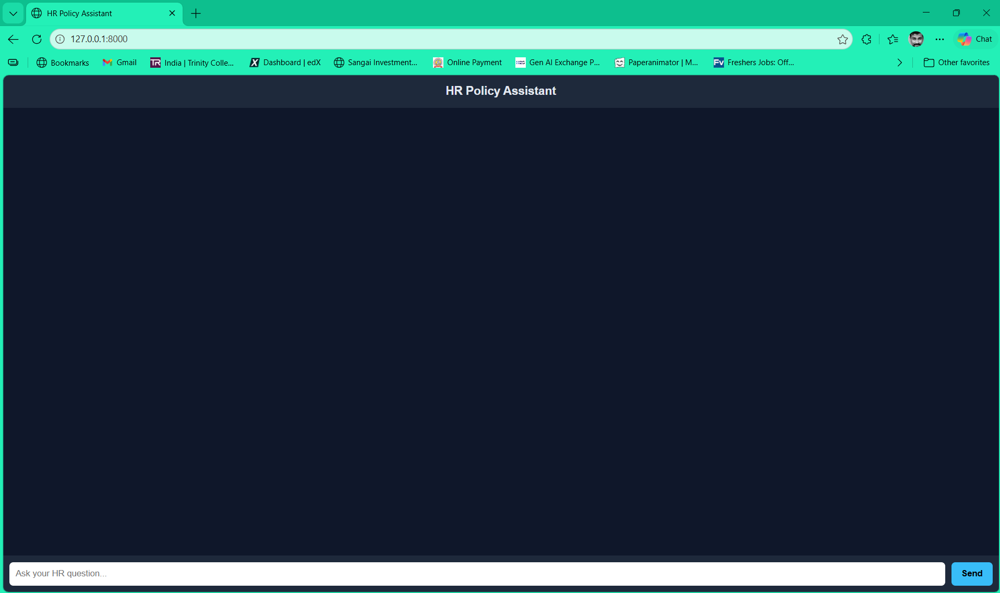
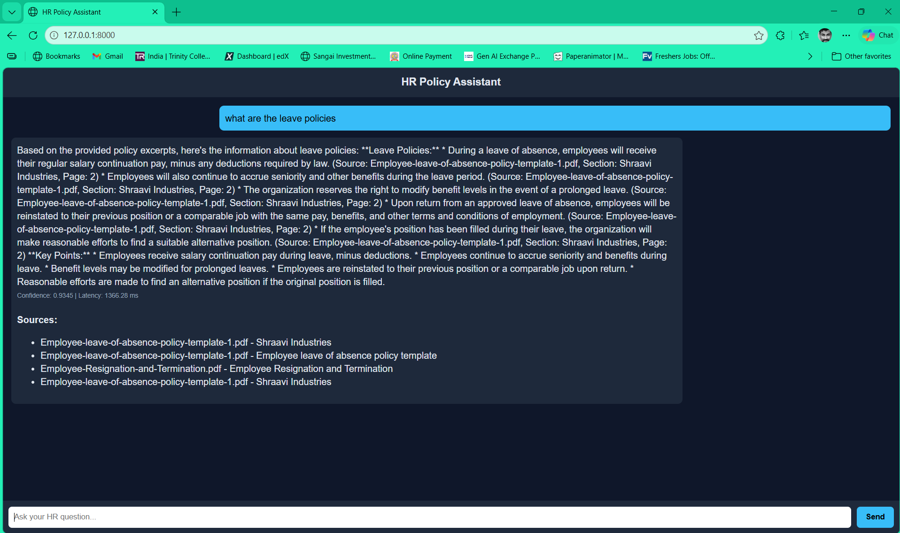

<div align="center">

# 🏛️ HR Policy Assistant

### An Enterprise-Grade Retrieval-Augmented Generation (RAG) System

*Answer employee HR policy questions instantly — grounded in your company documents, zero hallucinations.*

---


</div>

---

## 📌 Overview

**HR Policy Assistant** is a production-ready AI system that lets employees ask questions about company HR policies in plain English and receive accurate, cited answers — instantly.

It is built on a technique called **Retrieval-Augmented Generation (RAG)**: instead of relying on a general AI that might hallucinate, the system searches your actual policy documents first, retrieves the most relevant sections, and then uses a Large Language Model (LLaMA 3) to compose a grounded answer with full source citations.

### What is RAG — in Simple Words

> Think of RAG as giving an AI a specific set of books to read, and then asking it questions. It will **only answer from those books** — it won't guess or make things up. And it will always tell you which page it read the answer from.

### Real-World Problem It Solves

In any organisation, employees constantly have questions like:
- *"How many days of annual leave am I entitled to?"*
- *"What is the notice period if I want to resign?"*
- *"Does the company cover mental health support under employee benefits?"*

Without a system like this, they must search through 10–20 dense PDF documents or wait 24–48 hours for an HR email reply. This project eliminates that friction entirely.

---

## 🎯 Features

- 🔍 **Hybrid Search** — combines semantic (meaning-based) FAISS search with BM25 keyword search for maximum recall
- 🏆 **Cross-Encoder Re-ranking** — a second AI model deeply scores each candidate to select only the most relevant chunks
- 🛡️ **Zero Hallucination Guarantee** — confidence threshold gate ensures the system says "I don't know" rather than guessing
- 📄 **Full Source Citations** — every answer includes document name, section title, and page number
- ⚡ **Sub-Second Responses** — typical query latency of 300–1500ms
- 📂 **Multi-Format Document Support** — PDF, DOCX, DOC, TXT, and Markdown files
- 🔄 **Live Re-indexing** — add new documents and rebuild the index without restarting the server
- 🌐 **REST API** — FastAPI backend with auto-generated Swagger documentation at `/docs`
- 💬 **Web Chat Interface** — zero-dependency HTML/CSS/JS frontend, no build step required
- 🖥️ **CLI Mode** — run interactive Q&A directly in the terminal
- 🏥 **Health Monitoring** — `/api/health` endpoint reports index stats, model info, and pipeline readiness

---

## 🧠 How It Works — RAG Pipeline Explained

The system processes queries through a carefully designed pipeline with two phases:

### Phase 1 — Document Ingestion (One Time)

This phase runs once when you first set up the system. It prepares all documents so they can be searched in milliseconds.

```
HR Policy Documents (PDF / DOCX / TXT)
            │
            ▼
    ┌──────────────────┐
    │  Document Parser │  ← unstructured library preserves page & section metadata
    └──────────────────┘
            │
            ▼
    ┌──────────────────┐
    │    Text Chunker  │  ← 800-char chunks with 150-char overlap (no info lost at edges)
    └──────────────────┘
            │
            ▼
    ┌──────────────────┐
    │ Embedding Model  │  ← all-MiniLM-L6-v2 converts text → 384-dimensional vectors
    └──────────────────┘
            │
     ┌──────┴──────┐
     ▼             ▼
 [FAISS Index]  [BM25 Index]    ← both saved to disk, ready for instant retrieval
```

**Embeddings explained simply:** Each chunk of text is converted into 384 numbers that capture its *meaning*. Similar text gets similar numbers — so "annual leave" and "vacation days" will be close together even though the words differ.

---

### Phase 2 — Query Processing (Every Question)

```
Employee Question
        │
        ▼
┌─────────────────┐
│   Scope Check   │  ← filters off-topic queries (e.g. "what's the weather?")
└─────────────────┘
        │
   ┌────┴────┐
   ▼         ▼
[FAISS]    [BM25]         ← semantic + keyword search, top-20 candidates each
   └────┬────┘
        ▼
┌─────────────────┐
│   RRF Fusion    │  ← Reciprocal Rank Fusion merges both lists fairly
└─────────────────┘
        │
        ▼
┌─────────────────┐
│ Cross-Encoder   │  ← deeply re-scores each (question, chunk) pair → top 5
│   Re-ranker     │
└─────────────────┘
        │
        ▼
┌─────────────────┐
│ Confidence Gate │  ← score < 0.3? → "I don't know" (no hallucination)
└─────────────────┘
        │
        ▼
┌─────────────────┐
│  LLaMA 3 (Groq) │  ← generates grounded answer from top-5 chunks only
└─────────────────┘
        │
        ▼
   Final Answer + Source Citations + Confidence Score + Latency
```

---

## 🏗️ Project Architecture

```
hr-policy-rag-system/
├── config.py              ← Central settings (env-driven, no hard-coded values)
├── ingestion.py           ← Document parsing, chunking, embedding, indexing
├── retrieval.py           ← Hybrid retrieval: FAISS + BM25 + RRF fusion
├── reranker.py            ← Cross-encoder re-ranking (selects best 5 chunks)
├── rag_pipeline.py        ← End-to-end pipeline orchestrator + CLI mode
├── prompt_templates.py    ← Engineered prompts and context formatter
├── api.py                 ← FastAPI REST API (4 endpoints)
├── requirements.txt       ← Python dependencies
├── .env.example           ← Environment variables template
├── setup.sh               ← One-command setup script
├── documents/             ← ⬅ Place your HR policy files here
├── vector_store/          ← Auto-created: FAISS index files
├── bm25_index.pkl         ← Auto-created: serialised BM25 index
└── frontend/
    └── index.html         ← Self-contained chat UI (no build step needed)
```

---

## 🛠️ Tech Stack

| Component | Technology | Why Used |
|-----------|-----------|----------|
| **Language** | Python 3.10+ | Industry standard for AI/ML; rich ecosystem |
| **LLM** | LLaMA 3 via Groq API | Meta's open-source model; Groq provides free, ultra-fast inference |
| **LLM Framework** | LangChain (LCEL) | Composable pipeline building; easy to swap components |
| **Embeddings** | `all-MiniLM-L6-v2` (SentenceTransformers) | Lightweight, fast, high-quality 384-dim embeddings |
| **Dense Index** | FAISS (IndexFlatIP) | Facebook's battle-tested vector search; exact cosine similarity |
| **Sparse Index** | BM25Okapi (rank-bm25) | Classic keyword retrieval; complements semantic search |
| **Re-ranker** | `ms-marco-MiniLM-L-6-v2` (CrossEncoder) | Jointly scores (query, passage) pairs; far more accurate than bi-encoder alone |
| **Rank Fusion** | Reciprocal Rank Fusion (RRF) | Parameter-free merging of ranked lists; robust to score-scale differences |
| **Document Parsing** | Unstructured, pdfminer, python-docx | Preserves structural metadata (page, section, heading) |
| **Chunking** | LangChain `RecursiveCharacterTextSplitter` | Splits at natural boundaries (paragraphs → sentences → words) |
| **API** | FastAPI + Uvicorn | Async, high-performance; auto-generates Swagger docs |
| **Config Management** | python-dotenv + Pydantic | Type-safe, env-driven settings with no hard-coded secrets |
| **Logging** | Loguru | Clean, structured logging with minimal boilerplate |
| **Frontend** | Vanilla HTML/CSS/JS | Zero dependencies; works by opening a file in any browser |

---

## 📂 Project Structure — File by File

### `config.py` — The Control Panel
Central settings object. Every module imports `settings` from here — no scattered `os.getenv()` calls across the codebase. Reads all values from environment variables or a `.env` file.

Key settings:
- `CHUNK_SIZE = 800` — characters per document chunk
- `CHUNK_OVERLAP = 150` — overlap between consecutive chunks
- `INITIAL_RETRIEVAL_K = 20` — candidates retrieved per search method
- `RERANK_TOP_K = 5` — final chunks passed to the LLM
- `CONFIDENCE_THRESHOLD = 0.3` — minimum cross-encoder score to generate an answer

### `ingestion.py` — The Document Processor
Runs once to build the search indexes. Orchestrates: parse → chunk → embed → FAISS → BM25. Supports `unstructured` for rich parsing with automatic fallback to `pdfminer` / `python-docx` for simpler extraction.

### `retrieval.py` — The Hybrid Searcher
`HybridRetriever` class loads the FAISS index, BM25 index, and embedding model at startup. On each query, it runs both searches in parallel and merges results via RRF — combining the strengths of semantic and keyword retrieval.

### `reranker.py` — The Quality Filter
`CrossEncoderReranker` takes the merged top-20 candidates and scores each `(query, chunk)` pair jointly. Raw logits are sigmoid-normalised to `[0, 1]`. Returns the top-5 chunks sorted by descending confidence.

### `prompt_templates.py` — The AI Instructions
Contains the carefully engineered system prompt that enforces grounded answering, mandatory source citations, and explicit fallback behaviour. Also contains the context formatter that builds a structured text block from re-ranked chunks.

### `rag_pipeline.py` — The Orchestrator
`HRRagPipeline` class connects all components. Handles pipeline startup gracefully (sets `_ready=False` if indexes are missing instead of crashing). The `query()` method runs the full pipeline; `reload_retrieval()` hot-reloads indexes after ingestion without a server restart.

### `api.py` — The Web Interface
FastAPI application with four endpoints:

| Method | Endpoint | Description |
|--------|----------|-------------|
| `POST` | `/api/query` | Submit a question; returns answer + sources + confidence |
| `GET` | `/api/health` | Pipeline status, index stats, model info |
| `POST` | `/api/ingest` | Trigger background re-indexing |
| `GET` | `/api/documents` | List all documents in the documents directory |

---

## ⚙️ Installation & Setup

### Prerequisites

- Python 3.10 or higher
- A free [Groq API key](https://console.groq.com) (provides access to LLaMA 3)

### Option A — Automated Setup (Recommended)

```bash
# 1. Clone the repository
git clone https://github.com/nawadeakshay/hr-policy-rag-system.git
cd hr-policy-rag-system

# 2. Run the setup script
chmod +x setup.sh
./setup.sh
```

The script will: check your Python version, create a virtual environment, install all dependencies, and create your `.env` file from the template.

### Option B — Manual Setup

```bash
# 1. Clone the repository
git clone https://github.com/nawadeakshay/hr-policy-rag-system.git
cd hr-policy-rag-system

# 2. Create and activate virtual environment
python3 -m venv venv
source venv/bin/activate        # On Windows: venv\Scripts\activate

# 3. Install dependencies
pip install --upgrade pip
pip install -r requirements.txt

# 4. Configure environment
cp .env.example .env
```

### 5. Add your Groq API key

Open `.env` and add your key:

```env
GROQ_API_KEY=your_groq_api_key_here
```

> 💡 Get a free key at [console.groq.com](https://console.groq.com) — no credit card required.

> 🔒 Never commit your `.env` file to GitHub. It is already listed in `.gitignore`.

### 6. Add your HR policy documents

Place your PDF / DOCX / TXT files inside the `documents/` folder:

```
documents/
├── Anti-Fraud-Policy.pdf
├── Code-of-Ethics.pdf
├── Employee-Leave-Policy.docx
├── Employee-Benefits.pdf
└── Resignation-and-Termination.pdf
```

Supported formats: `.pdf`, `.docx`, `.doc`, `.txt`, `.md`

### 7. Run document ingestion

```bash
# Build the search indexes (runs once; takes 2–10 minutes depending on document count)
python ingestion.py

# To force a full rebuild of existing indexes:
python ingestion.py --force
```

### 8. Start the API server

```bash
uvicorn api:app --host 0.0.0.0 --port 8000 --reload
```

The API is now live at `http://localhost:8000`  
Auto-generated docs available at: `http://localhost:8000/docs`

---

## ▶️ Usage

### Web Interface

Open `frontend/index.html` directly in your browser, or serve it locally:

```bash
python -m http.server 5173 --directory frontend
# Visit: http://localhost:5173
```

### REST API

**Ask a question:**

```bash
curl -X POST http://localhost:8000/api/query \
  -H "Content-Type: application/json" \
  -d '{"question": "How many days of annual leave am I entitled to?"}'
```

**Check system health:**

```bash
curl http://localhost:8000/api/health
```

**Trigger re-indexing after adding new documents:**

```bash
curl -X POST "http://localhost:8000/api/ingest?force=true"
```

### CLI Mode (no frontend needed)

```bash
python rag_pipeline.py
```

```
============================================================
  HR Policy Assistant — Interactive CLI
  Type 'quit' or 'exit' to stop
============================================================

You: How many sick days do I get per year?
Assistant: According to the Employee Leave of Absence Policy (Section: Sick Leave Entitlement, Page 3), employees are entitled to 10 days of paid sick leave per calendar year. Unused sick leave does not carry over to the following year.

Sources:
  • Employee-leave-of-absence-policy.pdf | Section: Sick Leave Entitlement | Page: 3 | Score: 0.91

[Confidence: 0.91 | Latency: 412ms]
```

---

## 📊 Results

## 📸 Screenshots

### 🖥️ Web Interface


### 📊 Answer Output with Sources


### Example API Response

```json
{
  "answer": "According to the Employee Leave of Absence Policy (Section: Annual Leave Entitlement, Page 3), employees are entitled to 20 working days of paid annual leave per calendar year. Leave entitlement increases to 25 days after 5 years of continuous service.",
  "sources": [
    {
      "document": "Employee-leave-of-absence-policy.docx",
      "section": "Annual Leave Entitlement",
      "page": 3,
      "relevance_score": 0.9134,
      "excerpt": "Employees are entitled to 20 working days of paid annual leave per calendar year..."
    },
    {
      "document": "Employee-Benefits-and-Perks.pdf",
      "section": "Time Off Benefits",
      "page": 7,
      "relevance_score": 0.7821,
      "excerpt": "In addition to statutory leave, employees may apply for up to 5 days of unpaid leave..."
    }
  ],
  "confidence": 0.9134,
  "query": "How many days of annual leave am I entitled to?",
  "latency_ms": 447.3,
  "fallback_triggered": false
}
```

### Key Metrics

| Metric | Typical Value |
|--------|--------------|
| Query response time | 300 – 1500 ms |
| Confidence score (relevant query) | 0.70 – 0.95 |
| Confidence score (irrelevant query) | < 0.30 → fallback triggered |
| Document formats supported | PDF, DOCX, DOC, TXT, MD |
| Chunk size | 800 characters |
| Initial retrieval candidates | 20 per search method |
| Final chunks sent to LLM | Top 5 |

---

## 🌍 Real-World Applications

- **🏢 Enterprise HR Automation** — Deploy company-wide so thousands of employees get instant, consistent policy answers without overloading the HR department
- **🎓 Employee Onboarding** — New joiners can ask all their beginner questions at any hour without waiting for an HR representative
- **⚖️ Legal & Compliance** — Apply the same RAG architecture to legal documents, compliance manuals, or regulatory guidelines
- **🏥 Healthcare Protocols** — Hospital staff can query clinical protocols, drug administration guidelines, and infection control procedures
- **🏛️ Government Services** — Citizens or civil servants can query service rules, regulations, and government policy documents
- **📚 Educational Institutions** — Students can query academic regulations, scholarship policies, exam rules, and hostel guidelines

---

## ✅ Advantages

- **Zero hallucination** — The AI only answers from company documents and cites the exact source. If the answer isn't in the documents, it says so honestly
- **Full transparency** — Every answer shows which document, section, and page number the information came from — fully verifiable
- **Hybrid search accuracy** — Combining BM25 keyword search with FAISS semantic search catches more relevant results than either approach alone
- **Graceful failure** — A confidence threshold gate ensures the system never forces a low-quality answer; below the threshold it returns a clear fallback message
- **Production-ready** — Includes health checks, background task support, CORS configuration, structured logging, and proper error handling
- **No restart required** — New documents can be ingested and indexed without taking the API offline
- **Free to operate** — Uses Groq's free tier for LLaMA 3 inference (up to 30,000 API requests/month at no cost)
- **Minimal frontend** — The web UI is a single HTML file with no build tools, frameworks, or package managers

---

## ⚠️ Limitations

- **No conversation memory** — Each question is handled independently. The system does not retain context from previous messages in the current version
- **Text-only PDFs** — If policy information is embedded inside scanned images within a PDF (not machine-readable text), the system cannot extract it
- **English-primary** — The default embedding model (`all-MiniLM-L6-v2`) is optimised for English. Other languages will produce degraded results
- **Single-document synthesis** — If a complete answer spans multiple disconnected sections across different documents, the system may not always synthesise them perfectly
- **Groq rate limits** — The free tier has request-per-minute limits. High-traffic production deployments would require a paid plan or self-hosted LLM

---

## 🔮 Future Improvements

- [ ] **Conversation memory** — Handle follow-up questions within a session
- [ ] **Semantic caching** — Instant answers for repeated questions
- [ ] **Multilingual support** — Query in Hindi, Spanish, or any language
- [ ] **Query expansion** — Auto-enrich queries with synonyms
- [ ] **User feedback loop** — Rate answers to improve retrieval over time
- [ ] **Admin dashboard** — Visual UI for HR teams to manage documents
- [ ] **OCR support** — Handle scanned/image-based PDFs
- [ ] **Streaming responses** — Token-by-token answer display

---

## 🤝 Contributing

Contributions are welcome! To contribute:

1. Fork the repository
2. Create a feature branch: `git checkout -b feature/your-feature-name`
3. Commit your changes: `git commit -m "Add: your feature description"`
4. Push to the branch: `git push origin feature/your-feature-name`
5. Open a Pull Request

Please ensure your code follows the existing style and includes appropriate logging via `loguru`.

---

## 📜 License

This project is licensed under the **MIT License** — see the [LICENSE](LICENSE) file for details.

---

## 🙌 Acknowledgements

This project is built on the shoulders of excellent open-source tools and research:

| Tool / Library | Reference |
|----------------|-----------|
| **LangChain** | [langchain.com](https://www.langchain.com) — LLM application framework |
| **FAISS** | [github.com/facebookresearch/faiss](https://github.com/facebookresearch/faiss) — Facebook AI Similarity Search |
| **SentenceTransformers** | [sbert.net](https://www.sbert.net) — `all-MiniLM-L6-v2` embedding model |
| **Cross-Encoder** | [huggingface.co](https://huggingface.co/cross-encoder/ms-marco-MiniLM-L-6-v2) — `ms-marco-MiniLM-L-6-v2` re-ranker |
| **Groq + LLaMA 3** | [groq.com](https://groq.com) & [meta.com](https://llama.meta.com) — free, fast LLaMA 3 inference |
| **Unstructured** | [unstructured.io](https://unstructured.io) — intelligent document parsing |
| **rank-bm25** | [github.com/dorianbrown/rank_bm25](https://github.com/dorianbrown/rank_bm25) — BM25 implementation |
| **FastAPI** | [fastapi.tiangolo.com](https://fastapi.tiangolo.com) — modern Python API framework |
| **Loguru** | [github.com/Delgan/loguru](https://github.com/Delgan/loguru) — clean Python logging |

---

<div align="center">

Made with care for enterprises that value accuracy, transparency, and employee experience.

⭐ Star this repository if you found it useful!

</div>